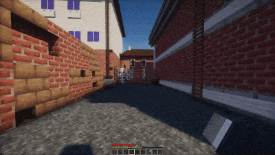
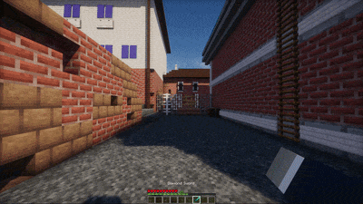

# 📘 Introduction

Armature is a first-person arm animation engine for Paper. It displays a rig from item profiles, chooses animations from vanilla or custom provider actions, and adds optional camera, movement, bob motion.

Armature controls presentation only. Weapon damage, ammo, projectiles and inventory authority remain owned by the compatible gameplay plugin.

## What Armature needs

* Paper server, from `1.21.4` to `latest`.
* [BetterModel](https://modrinth.com/plugin/bettermodel), required for rendering rigs.
* [PacketEvents](https://modrinth.com/plugin/packetevents), required to hide vanilla first person hand and optimizations.
* Optional providers: [WeaponMechanics](https://www.spigotmc.org/resources/weaponmechanics-guns-in-minecraft.99913/), [QualityArmory](https://www.spigotmc.org/resources/quality-armory.47561/), [CraftEngine](https://modrinth.com/plugin/craftengine) or an item plugin supported by Armature.

<figure><figcaption></figcaption></figure> <figure><figcaption></figcaption></figure>

