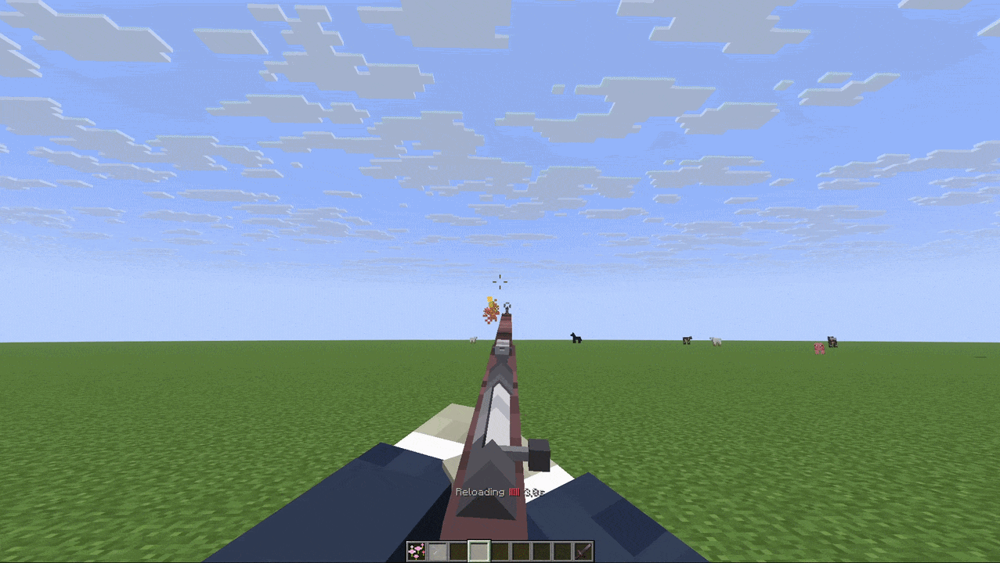

# 🔫 WeaponMechanics

Armature detects WeaponMechanics as an optional item and action provider. WeaponMechanics remains the owner of weapon identity, ammunition, reload logic, fire mode, aiming, damage, and cooldowns. Armature translates those events into first-person presentation actions and modern profile signals.

The provider id and namespace are `weaponmechanics`.

<figure><figcaption></figcaption></figure>

## Modern profile

Match the WeaponMechanics title with the namespaced item selector:

```yaml
m4a1:
  match:
    item: weaponmechanics:m4a1
  model:
    name: fp_rifle
    hide-vanilla-hand: true
  integrations:
    weaponmechanics:
      attachments:
        optic:
          bones:
            scope:
              visible: true
              offset: [0.0, 0.0, 0.0]
  animations:
    actions:
      - trigger: weaponmechanics:fire
        animation:
          name: fire
          duration: 4t
      - trigger: weaponmechanics:reload-start
        animation:
          name: reload
          duration: 20t
```

The WeaponMechanics item selector is the weapon title, not the display name. The provider emits hand metadata as `main_hand` or `off_hand`.

The optional `integrations.weaponmechanics.attachments` section contains arbitrary attachment ids. Each attachment contains only `bones`; each bone accepts `visible` and `offset`. An offset is either a three-number list or an `x`/`y`/`z` section:

```yaml
integrations:
  weaponmechanics:
    attachments:
      suppressor:
        bones:
          muzzle:
            visible: false
            offset:
              x: 0.0
              y: 0.0
              z: -0.1
```

## Provider actions and signals

The provider emits these presentation actions:

| Event                     | Armature action         | Namespaced signal                                  |
| ------------------------- | ----------------------- | -------------------------------------------------- |
| Weapon equipped           | `EQUIP`                 | `weaponmechanics:equip`                            |
| Weapon unequipped         | `UNEQUIP`               | `weaponmechanics:unequip`                          |
| Scope entered             | `AIM_ENTER`, then `AIM` | `weaponmechanics:aim-enter`, `weaponmechanics:aim` |
| Scope remains stacked     | `AIM`                   | `weaponmechanics:aim`                              |
| Scope exited              | `AIM_EXIT`              | `weaponmechanics:aim-exit`                         |
| Weapon fired from hip     | `FIRE`                  | `weaponmechanics:fire`                             |
| Weapon fired while aiming | `AIM_FIRE`              | `weaponmechanics:aim-fire`                         |
| Reload input              | signal only             | `weaponmechanics:reload`                           |
| Reload cycle starts       | `RELOAD_START`          | `weaponmechanics:reload-start`                     |
| Reload iteration          | `RELOAD_PHASE`          | `weaponmechanics:reload-phase`                     |
| Reload reaches capacity   | `RELOAD_COMPLETE`       | `weaponmechanics:reload-complete`                  |
| Reload is cancelled       | `RELOAD_CANCEL`         | `weaponmechanics:reload-cancel`                    |
| Firearm state changes     | `FIREARM_STATE`         | `weaponmechanics:firearm-state-change`             |
| Selective fire changes    | `FIRE_MODE_CHANGE`      | `weaponmechanics:fire-mode-change`                 |

Scope, fire, and reload events are main-hand presentation events. Equipment events can identify either hand.

`weaponmechanics:reload` is sent at the low-priority input stage, before WeaponMechanics performs its normal reload path. A modern rule with `consume: true` cancels the WeaponMechanics reload event. This is the one provider signal that can prevent the provider's own gameplay action; Armature still does not implement reload logic itself.

## Event details

Every provider event includes:

| Key            | Values                    |
| -------------- | ------------------------- |
| `weapon-title` | WeaponMechanics title     |
| `hand`         | `main_hand` or `off_hand` |

Scope events additionally include `zoom`. The exit event includes `automatic-after-shot`; Armature adds `aiming=true` or `aiming=false` to the corresponding modern signal.

Fire events include `aiming`.

Reload start and phase signals include:

| Key                                                 | Meaning                                  |
| --------------------------------------------------- | ---------------------------------------- |
| `cycle`                                             | Armature reload-cycle id.                |
| `phase`                                             | `load`.                                  |
| `ammo`, `ammo-before`, `ammo-after`                 | Ammo values for the iteration.           |
| `magazine-size`                                     | Current magazine capacity.               |
| `initial-ammo`, `initial-magazine-size`             | Values at the start of the cycle.        |
| `ammo-per-reload`                                   | Rounds loaded per iteration.             |
| `round-index`                                       | One-based reload iteration.              |
| `rounds-needed`, `rounds-added`, `rounds-remaining` | Cycle progress.                          |
| `final-round`                                       | Whether this iteration reaches capacity. |
| `reload-mode`                                       | `per-round` or `bulk`.                   |
| `reload-ticks`, `ammo-load-ticks`                   | WeaponMechanics reload timings.          |
| `firearm-open-ticks`, `firearm-close-ticks`         | Firearm transition timings.              |
| `firearm-type`                                      | Normalized WeaponMechanics firearm type. |

Reload complete reports `cycle`, `rounds-needed`, `rounds-remaining=0`, and `final-round=true`. WeaponMechanics can emit a completion event after each `Ammo_Per_Reload` iteration; Armature emits `RELOAD_COMPLETE` only when the magazine actually reaches capacity.

Reload cancel reports `elapsed-ticks` and, when a tracked cycle exists, `cycle`, `rounds-needed`, and `rounds-remaining`.

Firearm-state signals include: `state`, `firearm-state`, `phase`, `context` (`firearm`, `reload`, or `shot`), `firearm-type`, `time`, `firearm-ticks`, `firearm-open-ticks`, and `firearm-close-ticks`.

Fire-mode signals include `mode`, `fire-mode`, `old-mode`, `new-mode`, `old-selective-fire`, and `new-selective-fire`.

<figure><figcaption><p>Example of bolt firearm action with staged reload.</p></figcaption></figure>

## Conditions and examples

Use provider values in modern conditions. Dynamic right-hand values require the `$` prefix:

```yaml
animations:
  actions:
    - trigger: weaponmechanics:fire
      condition:
        all:
          - weaponmechanics.ammo > 0
          - weaponmechanics.ammo == $weaponmechanics:magazine-size
      animation:
        name: fire
        duration: 4t
```

The provider namespace is also available to integrations through the presentation API. It does not make gameplay state mutable from Armature configuration.

For the full built-in field list, see [Built-in conditions](../../getting-started/profiles/conditions.md) and [Built-in triggers](../../getting-started/profiles/triggers.md).
