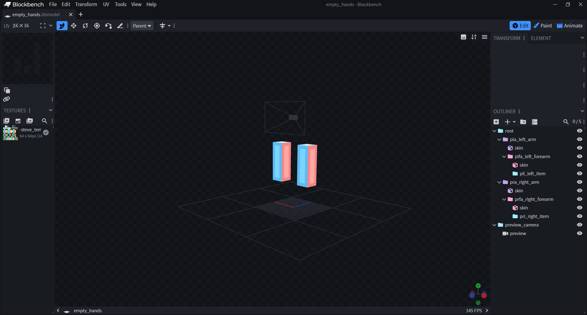

# 🧸 BlockBench Model

## Requirements

* Install [BlockBench](https://www.blockbench.net/)
* Install [Cameras](https://github.com/JannisX11/blockbench-plugins/blob/master/plugins/cameras.js) plugin in BlockBench

## Creating the model

To create your model, it is recommended to duplicate the `empty_hands.bbmodel` model file to already have the correct arms setup.

You will see this model inside:

<figure><figcaption><p>BlockBench app screenshot of the default arms model.</p></figcaption></figure>

Armature is using built-in [BetterModel bone prefixes](https://github.com/toxicity188/BetterModel/wiki/Create-player-animation#make-your-animation), such as:

```
head (ph)
right arm (pra)
right forearm (prfa)
left arm (pla)
left forearm (plfa)
hip (phip)
waist (pw)
chest (pc)
right leg (prl)
right foreleg (prfl)
left leg (pll)
left foreleg (plfl)
left item (pli)
right item (pri)
cape (cape)
```

## Adding the item

By default, the model is automatically displaying held items by the `pli_left_item` and `pri_right_item`, you can remove those bones if you don't want this and manually add your item.

Adding your item manually can be useful for guns, as you can see in `fp_rifle.bbmodel` model to have full control over it.

## Animating your model

### Setting up the viewport

First, it is recommended to split the viewport in `Double Horizontal` to see a preview of your animation from the player's eyes.

&#x20;

<figure><figcaption></figcaption></figure>

The smaller rectangle you see in the trop part of the viewport is the player's screen.

### Animations

Some default animations are present, you can delete them to create yours from scratch or use them as a base.

I recommend following [ModelEngine animating guide](https://git.lumine.io/mythiccraft/model-engine-4/-/wikis/Modeling/Animating-a-Model) since it's well explained and works the same as BetterModel.

#### Animations naming rules

<mark style="color:$danger;">**⚠️ DO NOT USE THOSE EXACT NAMES IN YOUR ANIMATIONS ⚠️**</mark>

<mark style="color:$danger;">`idle`</mark><mark style="color:$danger;">,</mark> <mark style="color:$danger;"></mark><mark style="color:$danger;">`walk`</mark><mark style="color:$danger;">,</mark> <mark style="color:$danger;"></mark><mark style="color:$danger;">`idle_fly`</mark><mark style="color:$danger;">,</mark> <mark style="color:$danger;"></mark><mark style="color:$danger;">`walk_fly`</mark><mark style="color:$danger;">,</mark> <mark style="color:$danger;"></mark><mark style="color:$danger;">`spawn`</mark>

Reason : BetterModel has a built-in actions system that automatically plays those exact animations, and Armature has no power to prevent that. Using those names will result on animation glitches caused by the interference of the two plugins.

Use alternative names for those animations or add a prefix/suffix like `armature_idle`, `a_idle`, `base`, `idlee` ...
